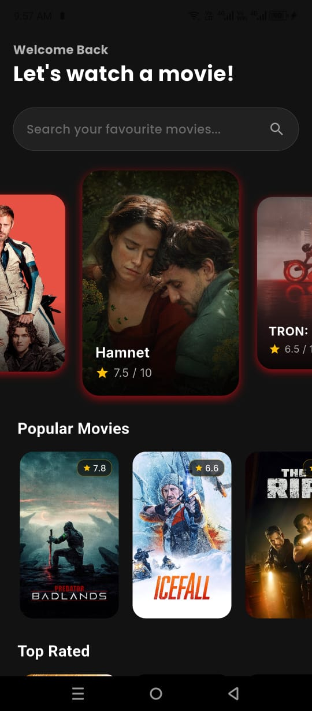
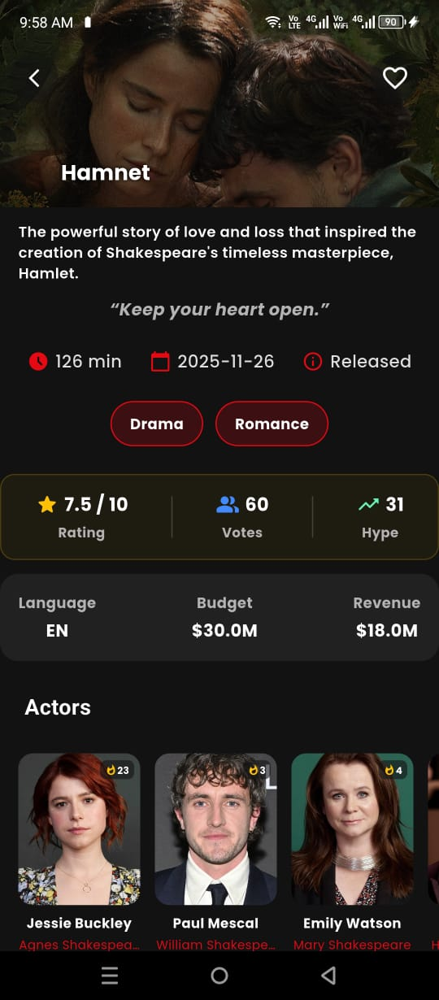
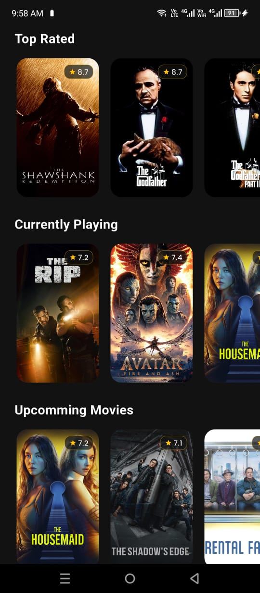
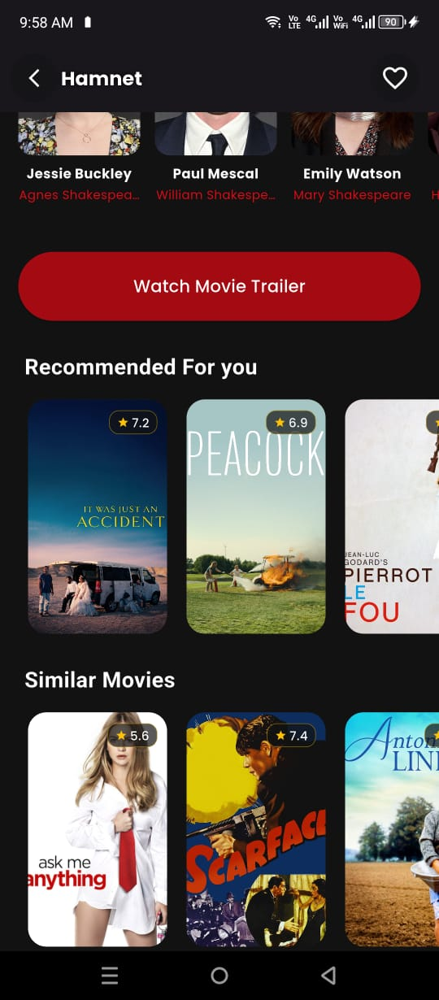

# Netflix Clone App (Flutter)

## UI Screenshots

Get a quick look at the main screens designed for the application.

| Home Screen | Movie Screen | Category Screen | Recommended Screen | Search Screen |
| :---: | :---: | :---: | :---: | :---: |
|  |  |  |  |  |

---

## 🙏 Acknowledgment

**A big thank you to Sir Ishaq Hassan for the invaluable mentorship and guidance** throughout the development and learning of Flutter concepts, which made the creation of this helpful, architecturally sound application possible.

---

A Netflix-inspired mobile application built using **Flutter**.  
This project demonstrates clean architecture, modern state management, and efficient API handling using **TMDB API**.

## Features

- Browse trending, popular, and upcoming movies
- Movie details with ratings and overview
- Smooth UI animations and carousel sliders
- Image caching for better performance
- Offline local storage support
- Clean and scalable MVVM architecture

---

## Tech Stack

- **Flutter**
- **Dart**
- **MVVM Architecture**
- **GetX** (State Management & Navigation)
- **Dio** (API Networking)
- **TMDB API**

---

## 📦 Packages Used

```yaml
dio: ^5.9.0
get: ^4.7.3
cached_network_image: ^3.4.1
hive: ^2.2.3
hive_flutter: ^1.1.0
fpdart: ^1.2.0
flutter_dotenv: ^6.0.0
shimmer: ^3.0.0
google_fonts: ^7.0.0
flutter_screenutil: ^5.9.3
carousel_slider: ^5.1.1
intl: ^0.20.2
```
---

A few resources to get you started if this is your first Flutter project:

- [YouTube: Sir Ishaq Hassan](https://www.youtube.com/@IshaqueHassan)
- [Lab: Write your first Flutter app](https://docs.flutter.dev/get-started/codelab)
- [Cookbook: Useful Flutter samples](https://docs.flutter.dev/cookbook)

For help getting started with Flutter development, view the
[online documentation](https://docs.flutter.dev/), which offers tutorials,
samples, guidance on mobile development, and a full API reference.


